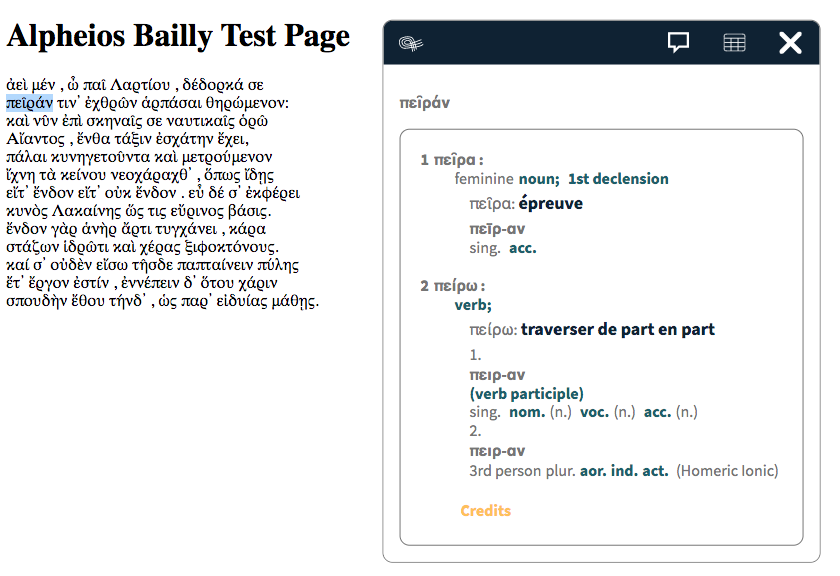

# Alpheios Ancient Greek → French dictionary

This repository contains materials related to adding Ancient Greek → French short definitions to the open source tool [Alpheios](https://alpheios.net/).

Please refer to [these instructions](./docs/workflow.md) that describe the data preparation workflow.

For an overview of the data see the dedicated [README](data/README.md) file.