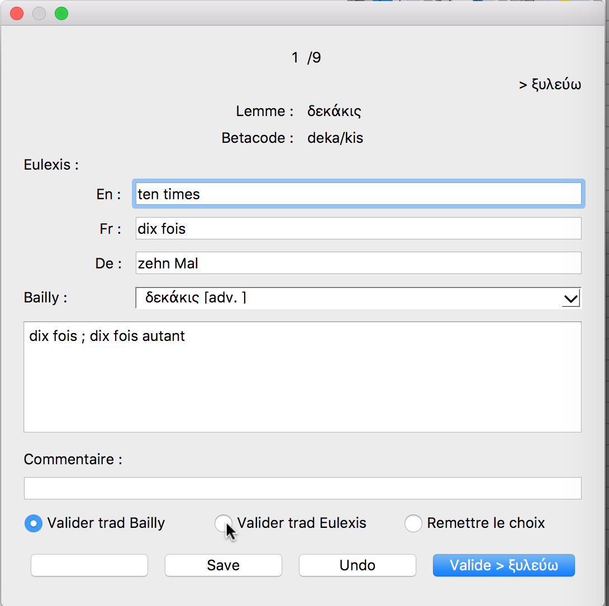

# Projet Alpheios-Eulexis pour l'ajout de traduction en Français aux lemmes grecs

## Introduction

### Historique

Les lemmes d'Eulexis sont _grosso modo_ ceux du LSJ et ils ont été utilisés 
pour la lemmatisation des formes par **Perseus** (et ses héritiers). 
Il y a déjà quelques années (lorsque j'ai développé la version résidente d'Eulexis), 
j'ai éprouvé le besoin de traduire en Français les traductions anglaises proposées 
par **Diogenes**, avec un succès assez mitigé.
Depuis, une équipe de bénévoles a mené à bien, sous la direction de Gérard Gréco, 
le passage en TeX du **Bailly**. 
Il m'a semblé naturel de partir de cette version du Bailly pour améliorer
les traductions françaises d'Eulexis. 
J'ai été rejoint sur ce sujet par Bridget Almas qui souhaite ajouter des traductions 
en Français dans Alpheios.

La magie de l'informatique a permis de mouliner le fichier TeX du Bailly.
J'en ai extrait les traductions françaises de beaucoup de lemmes
que j'ai ensuite alignées avec les traductions existantes dans Eulexis.
Le plus difficile reste à faire : **choisir** la _bonne_ traduction pour 
les ≈100 000 lemmes grecs qu'Eulexis connaît.

### Objectifs

L'objectif **principal** est de choisir la _bonne_ traduction. 
Le choix est à faire entre la traduction française dans Eulexis, si elle existe, 
et la traduction, ou l'une des traductions, issues du Bailly.
**Toutefois**, pour atteindre ce but, il est clair qu'il faudra relire également
les traductions anglaises (et éventuellement allemandes) et il serait _dommage_ 
de ne pas profiter de l'occasion pour les améliorer également.

### Méthode

Pour atteindre ces objectifs, nous misons sur un travail reparti sur 
plusieurs **volontaires**. L'idée est de partager l'ensemble des données 
en petits fichiers que chacun peut corriger indépendamment et à son rythme.
Pour ne pas devoir d'emblée affronter les 100 000 lemmes du lexique d'Eulexis, 
j'ai utilisé un fichier d'Helma Dik (de Logeion) qui donne le nombre d'occurrences 
relevées dans le corpus traité pour les divers lemmes. 
En se limitant aux lemmes qui apparaissent plus de *cinq* fois, on couvre presque 
**99%** du corpus avec *seulement* ≈20 000 lemmes. 
C'est donc ce premier lot qu'il faut traiter pour commencer.

Bien que les fichiers à traiter soient des fichiers CSV, **il n'est pas recommandé**
de les ouvrir et/ou de les éditer en dehors de l'outil conçu pour cela 
(et décrit ci-dessous). Cet outil prend un fichier d'origine, 
*first_007.csv* par exemple, pour produire un fichier *first_007_revu.csv*,
avec toutes les corrections apportées. Une fois que la re-lecture est terminée, 
le fichier *revu* doit être retourné au coordinateur qui les regroupe.

## L'outil dans Eulexis

Pour revoir et corriger l'ensemble des traductions d'Eulexis, j'ai développé 
un outil spécial que l'on trouve dans le menu "Extra/Vérifier les traductions".
S'ouvre alors une boîte de dialogue pour choisir le fichier à traiter.
On voit alors apparaître une fenêtre d'édition comme celle-ci :

En même temps, s'affichent dans la fenêtre principale d'Eulexis les articles
de dictionnaire correspondant au lemme traité.
Le choix des dictionnaires à afficher se fait dans le menu "Dicos".
Personnellement, je recommande de les afficher **tous** :
en effet, ils peuvent contenir des informations complémentaires et précieuses.

La boîte de dialogue s'ouvre, par défaut, au milieu de la fenêtre principale.
Il vaut donc mieux la déplacer pour que la lecture des dictionnaires puisse se faire 
sans qu'il soit nécessaire de changer de fenêtre active (sur Mac, on peut faire 
défiler le contenu d'une fenêtre sans qu'elle soit active).
Cela permet aussi de revenir par un simple clic sur la boîte de dialogue 
si on l'a quittée pour aller faire autre chose (en particulier, suivre un renvoi 
dans les dictionnaires).
Si la boîte de dialogue a été enterrée sous d'autres fenêtres, 
il est possible de la remettre au premier plan en retournant
dans le menu "Extra/Vérifier les traductions".
Si le programme voit qu'il y a une boîte de dialogue déjà ouverte,
il la met au premier plan plutôt que d'ouvrir un nouveau fichier.

### Description

Les quatre premières lignes sont informatives et ne peuvent pas être modifiées.
Elles contiennent :
1. un indicateur de progression (_ici 1/9_) qui donne le numéro du lemme et le nombre total de lemmes à traiter dans ce fichier
2. les lemmes précédent (à gauche, _ici il est vide_) et suivant (à droite) –cette indication est utile surtout pour les homonymes–
3. le lemme à examiner en caractères grecs
4. le lemme à examiner en betacode

Viennent ensuite une ligne de titre `Eulexis` et trois lignes avec les traductions 
qui sont déjà dans Eulexis. Dans l'ordre, elles sont en Anglais, Français et Allemand. 
Ces deux dernières ont été obtenues par traduction automatique de la traduction 
anglaise, sauf quand je les ai corrigées manuellement. 
Ces trois traductions sont éditables. Les outils standards 
(copier/coller à partir de la fenêtre de consultation, 
sélection d'un mot par double-clic, 
avance rapide d'un mot ou jusqu'à la fin de la ligne, etc...) 
sont disponibles comme d'habitude.
Chaque ligne peut contenir une cinquantaine de caractères et 
c'est un maximum pour une définition courte.

La situation avec le Bailly est un peu plus _compliquée_, 
car il peut y avoir plusieurs candidats pour un même lemme.
En plus de la fenêtre d'édition (qui est plus grande car l'extraction automatique
des traductions a parfois donné des traductions trop longues), 
j'ai dû mettre une **comboBox**.
Après le titre `Bailly`, la **comboBox** donne la ou les solutions trouvée(s). 
Par convention, je mets un fond de couleur quand cette comboBox requiert
une attention redoublée. 
Si le fond est **blanc**, il n'y a qu'une solution et elle est _exacte_. 
Il n'y a pas lieu de s'en soucier.
Si le lemme n'a pas été trouvé dans le Bailly, la comboBox restera vide et
sera **grisée**. La fenêtre d'édition sera aussi désactivée.
La seule traduction française disponible est alors celle d'Eulexis
qu'il conviendra d'éditer (voir ci-dessus).
Si le fond est **jaune orangé**, il n'y a toujours qu'une solution **mais** 
elle est _approchée_. 
Elle peut différer du lemme recherché par un accent, un esprit 
(plus généralement, un signe diacritique) ou une majuscule/minuscule.
La conduite à tenir est décrite plus en détails dans la section suivante.
S'il y a **plusieurs** solutions possibles, le fond de la comboBox sera **vert** 
(solutions _exactes_) ou **rouge** (solutions _approchées_). 
Il y a alors **un choix de plus** à effectuer. 
Le contenu de la fenêtre d'édition est mis à jour à chaque changement d'item dans 
la comboBox. Lors de la **validation** (voir plus bas), c'est la traduction affichée
qui sera choisie comme nouvelle traduction (donc celle qui correspond au 
lemme choisi dans la comboBox, éventuellement modifiée). 

La ligne de commentaire est facultative : elle sera sauvée dans le fichier *revu*.
Elle sera également affichée à nouveau si on ouvre le fichier *revu* une deuxième fois.
Il est recommandé de l'utiliser si on souhaite laisser des indications, 
en particulier lorsque l'on utilise l'option "Remettre le choix" (voir ci-dessous).

La ligne avec les trois boutons-radios permet de **choisir** la traduction 
qui figurera ultérieurement dans Eulexis (pas tout de suite : il faut regrouper 
les diverses corrections avant de proposer une mise à jour du lexique). Par défaut,
le programme choisit la traduction du Bailly si elle existe. 
Si le lemme a déjà été revu (soit parce que l'on est revenu en arrière, 
soit parce que l'on a ouvert un fichier *revu*), c'est la traduction d'Eulexis
qui est validée par défaut (elle contient la traduction qui a été sélectionnée !).
Le dernier bouton _Remettre le choix_ doit être utilisé avec parcimonie et être réservé
aux cas difficiles ou indécidables. Il est recommandé de laisser un commentaire.
À un moment ou à un autre, quelqu'un devra faire un choix...

La dernière ligne porte les boutons d'action. A priori, le seul à utiliser est
le dernier à droite qui sert à valider les modifications et les choix.
C'est aussi le bouton par défaut, ce qui signifie que si l'on appuie sur la touche
`Return`, les modifications seront validées. Ça ne fonctionne pas si le curseur est 
dans la fenêtre multiligne d'édition de la traduction du Bailly.
En effet, dans ce cas-là, le système intercepte le `Return` pour insérer 
un saut de ligne dans ladite fenêtre. 
Après la validation, le programme passe au lemme suivant.
Le bouton de gauche permet de revenir au lemme précédent (dans l'image ci-dessus, il est vide car on est au début du fichier).
**Attention !** ce bouton ne valide pas les modifications en cours.
Si on a déjà modifié les traductions et que l'on veut quand même revenir en arrière, 
il conviendra de **valider** d'abord et de revenir de deux pas en arrière.
La sauvegarde des données se fait automatiquement à la fin du fichier.
Le bouton `Save` n'est à utiliser que si on doit laisser le travail en plan 
et que l'on craint une possible panne de l'ordinateur. Une fois la sauvegarde faite,
seront proposées deux options : continuer ou interrompre la vérification.
**Attention !** comme le bouton de retour en arrière, le bouton `Save` ne valide pas 
les modifications en cours. Ce n'est pas un problème si on continue son travail.
En revanche, les modifications présentes sur l'écran mais pas validées seront
perdues si on choisit d'interrompre l'activité.
Une vérification interrompue peut être reprise en ouvrant le fichier _revu_.
Le programme avance automatiquement jusqu'au premier lemme qui n'a pas été revu.
Si l'ensemble du fichier a été revu, on recommence au début.

### Détails

#### La comboBox

#### Les boutons-radios

Le principe des boutons-radios est qu'il faut en choisir un (et un seul).
Ils conviennent donc parfaitement pour notre **mission première** qui consiste
à **choisir** entre la traduction française d'Eulexis et une nouvelle traduction
issue du dépouillement automatique du **Bailly**.
Toutefois, nous avons envisagé une troisième possibilité qui est de `Remettre le choix` 
à plus tard. Ce _non-choix_ n'est pas une solution à privilégier.
Tôt ou tard, d'une façon ou d'une autre, quelqu'un devra décider d'une traduction à
donner au lemme. Il faut donc considérer ce _non-choix_ comme un _Joker_ 
que l'on peut tirer de sa manche. Comme je l'ai dit plus haut,
un commentaire sera bienvenu pour aider celui qui héritera du problème.

A priori, le programme fait un choix raisonnable pour l'utilisateur :
- si le Bailly propose une ou plusieurs solutions, la traduction issue du Bailly est sélectionnée
- si le Bailly n'a pas le lemme demandé, la traduction d'Eulexis est la seule possible
- si le lemme a déjà été examiné, la traduction d'Eulexis (la nouvelle) est privilégiée.

Bien évidemment, le correcteur peut changer ce choix par défaut, en particulier, si la traduction initiale d'Eulexis est satisfaisante et meilleure que celle tirée du Bailly.

#### Le bouton de "Validation"

#### Le bouton de retour

#### Le bouton "Save"

#### Le bouton "Undo"
