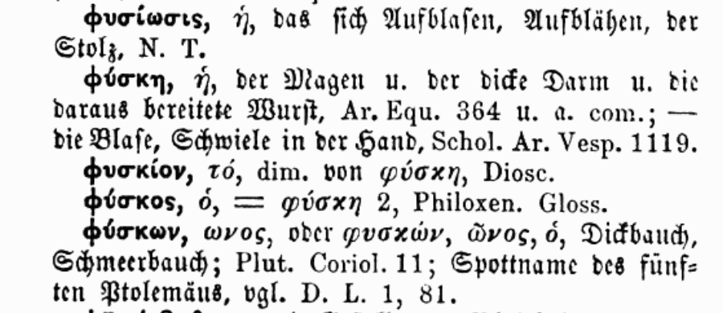

# Projet Alpheios-Eulexis pour l'ajout de traduction en Français aux lemmes grecs

## Introduction

### Historique

Les lemmes d'Eulexis sont _grosso modo_ ceux du LSJ et ils ont été utilisés 
pour la lemmatisation des formes par **Perseus** (et ses héritiers). 
Il y a déjà quelques années (lorsque j'ai développé la version résidente d'Eulexis), 
j'ai éprouvé le besoin de traduire en Français les traductions anglaises proposées 
par **Diogenes**, avec un succès assez mitigé.
Depuis, une équipe de bénévoles a mené à bien, sous la direction de Gérard Gréco, 
le passage en TeX du **Bailly**. 
Il m'a semblé naturel de partir de cette version du Bailly pour améliorer
les traductions françaises d'Eulexis. 
J'ai été rejoint sur ce sujet par Bridget Almas qui souhaite ajouter des traductions 
en Français dans Alpheios.

La magie de l'informatique a permis de mouliner le fichier TeX du Bailly.
J'en ai extrait les traductions françaises de beaucoup de lemmes
que j'ai ensuite alignées avec les traductions existantes dans Eulexis.
Le plus difficile reste à faire : **choisir** la _bonne_ traduction pour 
les ≈100 000 lemmes grecs qu'Eulexis connaît.

### Objectifs

L'objectif **principal** est de choisir la _bonne_ traduction. 
Le choix est à faire entre la traduction française dans Eulexis, si elle existe, 
et la traduction, ou l'une des traductions, issues du Bailly.
**Toutefois**, pour atteindre ce but, il est clair qu'il faudra relire également
les traductions anglaises (et éventuellement allemandes) et il serait _dommage_ 
de ne pas profiter de l'occasion pour les améliorer également.

### Méthode

Pour atteindre ces objectifs, nous misons sur un travail reparti sur 
plusieurs **volontaires**. L'idée est de partager l'ensemble des données 
en petits fichiers que chacun peut corriger indépendamment et à son rythme.
Pour ne pas devoir d'emblée affronter les 100 000 lemmes du lexique d'Eulexis, 
j'ai utilisé un fichier d'Helma Dik (de Logeion) qui donne le nombre d'occurrences 
relevées dans le corpus traité pour les divers lemmes. 
En se limitant aux lemmes qui apparaissent plus de *cinq* fois, on couvre presque 
**99%** du corpus avec *seulement* ≈20 000 lemmes. 
Pour se donner un premier objectif facilement accessible, on a préféré recouper
ces 20 000 lemmes en deux en prenant d'abord ceux dont la fréquence est supérieure à 40.
C'est donc ce premier lot de ≈6 000 lemmes qu'il faut traiter pour commencer.

Bien que les fichiers à traiter soient des fichiers CSV, **il n'est pas recommandé**
de les ouvrir et/ou de les éditer en dehors de l'outil conçu pour cela 
(et décrit ci-dessous). Cet outil prend un fichier d'origine, 
*first_007.csv* par exemple, pour produire un fichier *first_007_revu.csv*,
avec toutes les corrections apportées. Une fois que la re-lecture est terminée, 
le fichier *revu* doit être retourné au coordinateur qui les regroupe.

## L'outil dans Eulexis

Pour revoir et corriger l'ensemble des traductions d'Eulexis, j'ai développé 
un outil spécial que l'on trouve dans le menu "Extra/Vérifier les traductions".
S'ouvre alors une boîte de dialogue pour choisir le fichier à traiter.
Quand ce premier choix est fait,
on voit apparaître une fenêtre d'édition comme celle-ci :

En même temps, s'affichent dans la fenêtre principale d'Eulexis les articles
de dictionnaire correspondant au lemme traité.
Le choix des dictionnaires à afficher se fait dans le menu "Dicos".
Personnellement, je recommande de les afficher **tous** :
en effet, ils peuvent contenir des informations complémentaires et précieuses.

La boîte de dialogue s'ouvre, par défaut, au milieu de la fenêtre principale.
Il vaut donc **mieux la déplacer** pour que la lecture des dictionnaires puisse se faire 
sans qu'il soit nécessaire de changer de fenêtre active (sur Mac, on peut faire 
défiler le contenu d'une fenêtre sans qu'elle soit active).
Cela permet aussi de revenir par un simple clic sur la boîte de dialogue 
si on l'a quittée pour aller faire autre chose (en particulier, suivre un renvoi 
dans les dictionnaires). On peut évidemment faire d'autres choses sans fermer
cette boîte de dialogue : consulter le LSJ sur Logeion (le LSJ d'Eulexis a *perdu*
les numéros des sens), aller voir le Pape sur Zeno.org (l'original), parcourir
quelque fichier que l'on a sur l'ordinateur ou même répondre à un mail urgent.
Si la boîte de dialogue a été enterrée sous d'autres fenêtres, 
il est possible de la remettre au premier plan en retournant
dans le menu "Extra/Vérifier les traductions".
Si le programme voit qu'il y a une boîte de dialogue déjà ouverte,
il la met au premier plan plutôt que d'ouvrir un nouveau fichier.

### Description

Les quatre premières lignes sont informatives et ne peuvent pas être modifiées.
Elles contiennent :
1. un indicateur de progression (_ici 1/9_) qui donne le numéro du lemme et le nombre total de lemmes à traiter dans ce fichier
2. les lemmes précédent (à gauche, _ici il est vide_) et suivant (à droite) –cette indication est utile surtout pour les homonymes–
3. le lemme à examiner en caractères grecs
4. le lemme à examiner en betacode

Viennent ensuite une ligne de titre `Eulexis` et trois lignes avec les traductions 
qui sont déjà dans Eulexis. Dans l'ordre, elles sont en Anglais, Français et Allemand. 
Ces deux dernières ont été obtenues par traduction automatique de la traduction 
anglaise, sauf quand je les ai corrigées manuellement. 
Ces trois traductions sont éditables. Les outils standards 
(copier/coller à partir de la fenêtre de consultation, 
sélection d'un mot par double-clic, 
avance rapide d'un mot ou jusqu'à la fin de la ligne, etc...) 
sont disponibles comme d'habitude.
Chaque ligne peut contenir une cinquantaine de caractères et 
c'est un maximum pour une définition courte.

La situation avec le Bailly est un peu plus _compliquée_, 
car il peut y avoir plusieurs candidats pour un même lemme.
En plus de la fenêtre d'édition (qui est plus grande car l'extraction automatique
des traductions a parfois donné des traductions trop longues), 
j'ai dû mettre une **comboBox**.
Après le titre `Bailly`, la **comboBox** donne la (ou les) solution(s) trouvée(s). 
Par convention, je mets un fond de couleur quand cette comboBox requiert
une attention redoublée. 
Si le fond est **blanc**, il n'y a qu'une solution et elle est _exacte_. 
Il n'y a pas lieu de s'en soucier.
Si le lemme n'a pas été trouvé dans le Bailly, la comboBox restera vide et
sera **grisée**. La fenêtre d'édition sera aussi désactivée.
La seule traduction française disponible est alors celle d'Eulexis
qu'il conviendra d'éditer (voir ci-dessus).
Si le fond est **jaune orangé**, il n'y a toujours qu'une solution **mais** 
elle est _approchée_. 
Elle peut différer du lemme recherché par un accent, un esprit 
(plus généralement, un signe diacritique) ou une majuscule/minuscule.
La conduite à tenir est décrite plus en détails dans la section suivante, avec quelques exemples en fin de document.
S'il y a **plusieurs** solutions possibles, le fond de la comboBox sera **vert** 
(solutions _exactes_) ou **rouge** (solutions _approchées_). 
Il y a alors **un choix de plus** à effectuer. 
Le contenu de la fenêtre d'édition est mis à jour à chaque changement d'item dans 
la comboBox. Lors de la **validation** (voir plus bas), c'est la traduction affichée
qui sera choisie comme nouvelle traduction (donc celle qui correspond au 
lemme choisi dans la comboBox, éventuellement modifiée). 

**Nota bene :** si le (ou les) lemme(s) proposé(s) par le Bailly **ne sont pas bons**,
il conviendrait de les retirer de la liste. Comme il n'est pas possible de retirer un 
élément d'une comboBox, le correcteur **doit indiquer** que le lemme trouvé dans le Bailly
ne correspond pas à celui recherché en **effaçant la traduction**. Il devra alors
donner la _bonne_ traduction dans la line d'Eulexis et valider cette solution.
Cette _règle_ peut sembler étrange et ne serait pas nécessaire pour la seule 
traduction. En effet, pour le lexique d'Eulexis, que la traduction soit donnée
dans la case du Bailly ou dans celle d'Eulexis ne change rien. **Toutefois**,
la traduction donnée dans la case du Bailly reste associée à une entrée particulière.
**Implicitement**, en validant une traduction du Bailly, on établit un lien 
_(bi-univoque ?)_ entre le lemme recherché et celui du Bailly.
Si un jour quelqu'un veut établir une correspondance entre les entrées du LSJ 
(qui sont plus ou moins les lemmes d'Eulexis) et celles du Bailly, il devrait pouvoir 
utiliser ce fichier à condition que nous n'y introduisions pas de lien déplacé.

La ligne de commentaire est facultative : elle sera sauvée dans le fichier *revu*.
Elle sera également affichée à nouveau si on ouvre le fichier *revu* une deuxième fois 
ou que l'on revient sur un lemme déjà traité (avant d'avoir terminé le fichier).
Il est recommandé de l'utiliser si on souhaite laisser des indications, 
en particulier lorsque l'on utilise l'option "Remettre le choix" (voir ci-dessous).

La ligne avec les trois boutons-radios permet de **choisir** la traduction 
qui figurera ultérieurement dans Eulexis (pas tout de suite : il faut regrouper 
les diverses corrections avant de proposer une mise à jour du lexique). Par défaut,
le programme choisit la traduction du Bailly si elle existe. 
Si le lemme a déjà été revu (soit parce que l'on est revenu en arrière, 
soit parce que l'on a ouvert un fichier *revu*), c'est la traduction d'Eulexis
qui est validée par défaut (elle contient la traduction qui a été sélectionnée !).
Le dernier bouton _Remettre le choix_ doit être utilisé avec parcimonie et être réservé
aux cas difficiles ou indécidables. Il est recommandé de laisser un commentaire.
À un moment ou à un autre, quelqu'un devra faire un choix...

La dernière ligne porte les boutons d'action. A priori, le seul à utiliser est
le dernier à droite qui sert à valider les modifications et les choix.
C'est aussi le bouton par défaut, ce qui signifie que si l'on appuie sur la touche
`Return`, les modifications seront validées. Ça ne fonctionne pas si le curseur est 
dans la fenêtre multiligne d'édition de la traduction du Bailly.
En effet, dans ce cas-là, le système intercepte le `Return` pour insérer 
un saut de ligne dans ladite fenêtre. 
Après la validation, le programme passe au lemme suivant.
Le bouton de gauche permet de revenir au lemme précédent 
(dans l'image ci-dessus, il est vide car on est au début du fichier).
**Attention !** ce bouton ne valide pas les modifications en cours.
Si on a déjà modifié les traductions et que l'on veut quand même revenir en arrière, 
il conviendra de **valider d'abord** et de revenir de **deux pas** en arrière.
La sauvegarde des données se fait automatiquement à la fin du fichier.
Le bouton `Save` n'est à utiliser que si on doit laisser le travail en plan 
et que l'on craint une possible panne de l'ordinateur. Une fois la sauvegarde faite,
seront proposées deux options : continuer ou interrompre la vérification.
**Attention !** comme le bouton de retour en arrière, le bouton `Save` ne valide pas 
les modifications en cours. Ce n'est pas un problème si on continue son travail.
En revanche, les modifications présentes sur l'écran mais pas validées seront
**perdues** si on choisit d'interrompre l'activité.
Une vérification interrompue peut être reprise en ouvrant le fichier _revu_.
Le programme avance automatiquement jusqu'au premier lemme qui n'a pas été revu.
Si l'ensemble du fichier a été revu, on recommence au début.

### Détails

#### La comboBox

Comme je le disais plus haut, la comboBox a été introduite parce que, dans certains cas,
plusieurs entrées du Bailly correspondent au lemme demandé. D'autre part,
si le lemme recherché n'a pas été trouvé dans le Bailly, je le dépouille de tous
ses signes diacritiques et d'une éventuelle majuscule et je cherche à nouveau
dans le Bailly. Cela permet de retrouver des mots pour lesquels l'accent n'est pas
bien déterminé (ou qui a des variantes). Les trémas sont aussi souvent pomme de discorde.
Mais ce faisant, on introduit inévitablement des *faux positifs* qu'il faudra éliminer.
À l'affichage des dictionnaires dans Eulexis, la recherche se fait également
**sans tenir compte** des signes diacritiques et de la majuscule.
Donc, l'ensemble des articles affichés dans la fenêtre principale **ne sont pas 
nécessairement pertinents**.

Le cas le plus courant (90% dans le premier lot) est celui où **une seule solution 
exacte** a été trouvée. Le cas où il y a **deux** ou plus **solutions exactes**
se produit pour 8% des lemmes. Les 2% restant se partagent équitablement entre 
les cas où je n'ai pas trouvé le lemme dans le Bailly et ceux où il y a une ou
plusieurs **solutions approchées**. J'ai enrichi le second lot avec les cas approchés
trouvés dans l'ensemble des lemmes (y compris ceux de fréquence faible), 
si bien que les pourcentages y seront différents. Les mots que je n'ai pas trouvés 
dans le Bailly sont plus aussi nombreux parmi les lemmes moins fréquents.

Pour que le correcteur sache immédiatement si la comboBox est peuplée ou pas, 
je lui ai donné un fond de couleur.
Lorsque le fond est **blanc** ou **jaune-orangé**, il n'y a qu'un seul item 
dans la comboBox et il est inutile d'aller l'explorer. 
Le fond **blanc** nous dit de plus que la solution est exacte. 
Alors que le **jaune-orangé**, plus accrocheur, nous prévient qu'il faut redoubler
d'attention car la solution proposée n'est qu'approchée.
Lorsque le fond est **vert** ou **rouge**, il y a plusieurs items 
dans la comboBox et il **faut** faire un choix supplémentaire entre ces items.
Le fond **<span style="background-color: #A0FFA0">vert</span>**, plus doux et apaisant, nous dit que les solutions sont exactes.
Le fond **rouge**, plus agressif, nous dit que les solutions sont approchées.

*Remarque :* lorsque j'ai trouvé une solution exacte, je ne suis pas allé chercher
des solutions approchées. Il n'y a donc pas de cas mixte où une solution serait exacte
et une autre pas. Je ne sais pas si le cas se produit, mais il se pourrait que
mon programme ait trouvé une solution exacte alors que la bonne solution serait 
approchée. Il y a en effet des cas pathologiques comme, par exemple, `arma` :
les dicos s'accordent pour dire qu'il y en a trois, signifiant respectivement,
*chariot*, *union* et *nourriture*. Sauf qu'ils ne sont pas du même avis pour l'esprit.
Le LSJ et le Pape ont deux homonymes ἄρμα et un lemme non-ambigu ἅρμα, alors que
le Bailly donne deux ἅρμα et un seul ἄρμα. Je n'ai évidemment pas d'opinion sur le sujet,
mais si vous êtes convaincus que c'est une erreur de Bailly, n'hésitez pas
à le signaler à Gérard Gréco

#### Les boutons-radios

Le principe des boutons-radios est qu'il faut en choisir un (et un seul).
Ils conviennent donc parfaitement pour notre **mission première** qui consiste
à **choisir** entre la traduction française d'Eulexis et une nouvelle traduction
issue du dépouillement automatique du **Bailly**.
Toutefois, nous avons envisagé une troisième possibilité qui est de `Remettre le choix` 
à plus tard. Ce _non-choix_ n'est pas une solution à privilégier.
Tôt ou tard, d'une façon ou d'une autre, quelqu'un devra décider d'une traduction à
donner au lemme. Il faut donc considérer ce _non-choix_ comme un _Joker_ 
que l'on peut tirer de sa manche. Comme je l'ai dit plus haut,
un commentaire sera bienvenu pour aider celui qui héritera du problème.

A priori, le programme fait un choix raisonnable pour l'utilisateur :
- si le Bailly propose une ou plusieurs solutions, la traduction issue du Bailly est sélectionnée
- si le Bailly n'a pas le lemme demandé, la traduction d'Eulexis est la seule possible
- si le lemme a déjà été examiné, la traduction d'Eulexis (la nouvelle) est privilégiée, sauf si le choix a été remis la première fois (auquel cas, le choix reste sur cette position).

Bien évidemment, le correcteur peut changer ce choix par défaut, en particulier, si la traduction initiale d'Eulexis est satisfaisante et meilleure que celle tirée du Bailly.

#### Le bouton de "Validation"

Le bouton de `Validation` est la pièce maîtresse du dispositif. Associé au choix
fait à l'aide des *boutons-radios*, il enregistre la nouvelle traduction française
pour le lemme traité. Il enregistre également les traductions anglaise et allemande
qui peuvent avoir été modifiées.
**Toutefois**, en validant une traduction du Bailly, on fait *plus que* d'adopter
une nouvelle traduction : on *établit* un lien entre le lemme d'Eulexis 
(qui est _grosso modo_ celui du LSJ) et une entrée du Bailly.

Considérons à titre d'exemple, un cas où la traduction actuelle d'Eulexis et la même
que celle tirée du Bailly. Je peux donc choisir indifféremment l'une ou l'autre 
ça ne changera pas la traduction finale (puisqu'elles sont égales). 
Toutefois, est-ce que l'information apportée par les deux choix est la même ?
La réponse est évidemment non. En effet, lorsque je choisis la traduction existante
dans Eulexis, je n'apporte aucune information sur le Bailly. En revanche, en choisissant
la traduction du Bailly, je dis implicitement que cette entrée du Bailly correspond
au lemme recherché. Je donne plus bas quelques exemples *représentatifs*.

#### Le bouton de retour

#### Le bouton "Save"

#### Le bouton "Undo"

Comme son nom l'indique, le bouton `Undo` permet de défaire les modifications en cours.
Ces dernières seront évidemment perdues, sauf à annuler l'opération pendant qu'il 
est encore temps. Si on effectue cette opération sur un lemme déjà traité et validé 
(en utilisant le bouton de retour), on revient aux données qui étaient dans le fichier
quand on l'a ouvert la première fois. Ce bouton `Undo` ne permettra pas de revenir
à une version intermédiaire qui aurait été sauvée avec le bouton `Save`.

Le `Ctrl-Z` (`Cmd-Z` sur Mac) peut être un mode de revenir en arrière plus subtil.
En effet, il permet de défaire les modifications apportées *cases par cases*.
Par exemple imaginons que nous ayons modifié la traduction anglaise, **puis**
la traduction allemande. Nous nous ravisons alors pour la traduction anglaise,
souhaitant revenir à ce qu'il y avait avant (tout en voulant conserver les 
modifications faites sur la traduction allemande). Il suffit de placer le curseur
dans la ligne de la traduction anglaise et à faire `Ctrl-Z`. C'est magique :
la modification de la traduction anglaise est annulée **et**
ce qui a été fait après dans la case des traductions allemandes est maintenu.
**Remarque :** cela ne fonctionne pas dans le cadre des traductions du Bailly,
si on change de lemme avec la comboBox (cela fonctionne si on n'a pas changé de lemme).

En revanche, si on ouvre un fichier *revu* et que le fichier d'origine est resté à côté
du fichier créé (ce qui est normalement le cas), le correcteur peut revenir
aux données telles qu'elles étaient dans le fichier d'origine (annulant ainsi toutes les 
modifications) ou aux données déjà revues (n'annulant que les dernières modifications).

### Exemples

On a vu plus haut que le choix d'une traduction du Bailly est plus que la simple
attribution d'une nouvelle traduction au lemme, puisqu'il lie ce dernier à
une entrée particulière du Bailly.
Si on va jusqu'au bout de ce raisonnement et que l'on considère l'exemple d'ὁράω
````TSV
ὁράω	to see, look, be able to see	ὁράω [tr. intr. ]	voir ; voir	voir, regarder, pouvoir voir
````
La traduction d'Eulexis (dernière colonne) est *meilleure* que celle tirée du Bailly
(avant-dernière colonne). Cette dernière semble même *idiote*, mais le premier "voir"
correspond à l'emploi intransitif de ce verbe et le second à l'emploi transitif.
On serait donc tenté d'adopter la traduction d'Eulexis, mais il vaudrait mieux 
modifier la traduction du Bailly (en prenant des éléments qu'il donne ensuite) 
et la choisir. Toutefois, étant conscient que cela imposerait beaucoup de travail 
supplémentaire et en considérant qu'il n'y a pas **ici** d'ambiguïté possible,
la première solution est acceptable.

#### Exemples d'homonymes

Les cas d'homonymie ne sont pas rares, mais il ne m'a pas été facile d'en dénicher
un simple :
````TSV
στεῖρα1	a ship's keel	2 στεῖρα [gens : ας, adj. f. ]@1 στεῖρα [gens : ης (ἡ) ]	stérile@étrave d'un navire	la quille d'un navire
στεῖρα2	that has not brought forth young	2 στεῖρα [gens : ας, adj. f. ]@1 στεῖρα [gens : ης (ἡ) ]	stérile@étrave d'un navire	Cela n'a pas donné naissance à de jeunes
````
Par chance, la numérotation des homonymes est ici la même.
Pour **στεῖρα1** (traduit en anglais par *a ship's keel*), il faudra supprimer la 
traduction _stérile_ du premier item pour garder celle de _1 στεῖρα_. 
Pour **στεῖρα2**, on gardera _stérile_ et on supprimera _étrave d'un navire_.
En sélectionnant à chaque fois la bonne traduction (c'est à dire que l'on affiche, 
juste avant de valider, la solution que l'on souhaite retenir).
On peut aussi remarquer que la traduction anglaise est moins précise que celle du Bailly,
qui est en accord avec celle du LSJ. J'aurais donc tendance à compléter la traduction
anglaise en donnant *forepart of a ship΄s keel*.

Il y a d'autres exemples plus délicats. 
Il n'y a qu'un seul lemme ** βρῶμος** dans Eulexis, alors que les Bailly et LSJ connaissent deux homonymes.
````TSV
βρῶμος	stink, noisome smell	2 βρῶμος [gens : ου (ὁ) ]@1 βρῶμος > βρῶμα [gens : ου (ὁ) ]	odeur infecte@ce qu'on mange ; ce qui est mangé ou rongé ; action de dévorer	puant, odeur bruyante
````
Ce *caveat* étant posé, on sélectionnera la traduction *odeur infecte* de **2 βρῶμος**
en ayant soin d'effacer la traduction de **1 βρῶμος** qui est celle de βρῶμα.

Les traductions anglaises de συννέω et συννέω2 sont les mêmes, 
alors que le LSJ donne bien deux homonymes différents.
````TSV
συννέω	to pile or heap together, heap up	3 συννέω@2 συννέω@1 συννέω	entasser, amonceler@filer ou tisser ensemble@nager avec
συννέω2	pile	3 συννέω@2 συννέω@1 συννέω	entasser, amonceler@filer ou tisser ensemble@nager avec
````
Avec la difficulté supplémentaire que Bailly connaît trois homonymes pour ce mot.
Quel est alors la traduction à donner à συννέω2 ? 
Je suppose _nager avec_ puisque c'est la traduction du 2nd homonyme du LSJ.

Le cas de **καταδέω** est surprenant, car Eulexis en a trois homonymes 
(dont deux avec la même traduction) alors que les dicos n'en ont que deux.
````TSV
καταδέω 	to bind, take prisoner, convict, cast a spell on	2 καταδέω@1 καταδέω	manquer de, être en arrière de ; être inférieur à@lier solidement, attacher fortement ; bander, fermer ; condamner après avoir convaincu ; attacher pour soi ou à soi ; lier à soi (par un serment, etc.)
καταδέω1	to bind, take prisoner, convict, cast a spell on	2 καταδέω@1 καταδέω	manquer de, être en arrière de ; être inférieur à@lier solidement, attacher fortement ; bander, fermer ; condamner après avoir convaincu ; attacher pour soi ou à soi ; lier à soi (par un serment, etc.)
καταδέω2	lack	2 καταδέω@1 καταδέω	manquer de, être en arrière de ; être inférieur à@lier solidement, attacher fortement ; bander, fermer ; condamner après avoir convaincu ; attacher pour soi ou à soi ; lier à soi (par un serment, etc.)
````
On va suivre les traductions anglaises et associer **καταδέω _et_ καταδέω1** à 
**1 καταδέω** et **καταδέω2** à **2 καταδέω**.
A priori, l'un des deux lemmes καταδέω _et_ καταδέω1 devrait pouvoir être éliminé,
mais cela dépasse largement le but que l'on s'est donné ici.

#### Exemple approché (juste)

````TSV
κόιλος	hollow	κοῖλος [des : η, ον subst. ]	creux ; creusé, travaillé en creux, ciselé	creux
````
Le lemme d'Eulexis est **κόιλος** alors que les dicos s'accordent sur **κοῖλος**
comme entrée principale. Tous mentionnent aussi la forme **κόϊλος**. 
Les traductions concordent également, il semble donc légitime de lier les deux lemmes.

#### Exemple approché (faux)

````TSV
ἐφήβια	celebration on reaching adolescence	ἐφηϐία [gens : ας (ἡ) ]	adolescence ; > ἐφηϐεῖον	Célébration à l'adolescence
````
La forme **ἐφήβια** (avec l'accent sur le ή) ne se trouve que dans le Pape et 
semble bien désigner ce qu'indique la traduction anglaise. 
La forme trouvée dans le Bailly **ἐφηϐία** (accent sur le ί) se trouve, elle, 
dans tous les dicos et désigne l'*adolescence* et rien d'autre (ou presque).
On **effacera** donc la traduction du Bailly et on retouchera la traduction
d'Eulexis pour quelque chose du genre _fête pour célébrer l'adolescence_.

#### Dernier exemple, plus compliqué :

````TSV
φύσκος	botellus	2 Φύσκος [gens : ου (ὁ) ]@1 Φύσκος [gens : ου (ἡ) ]	Physkos@Physkos, (v.)	Botellus
````
Les deux entrées du Bailly sont approximatives et ne conviennent ni l'une ni l'autre.

Ce sont en effet deux noms de lieux, l'un masculin (montagne ou rivière) 
et l'autre féminin (ville).
Il **faut** donc les effacer toutes les deux et se reporter sur la traduction d'Eulexis.
"Botellus" est la traduction latine du mot grec et ne convient pas vraiment. 
Une solution est d'aller voir dans Collatinus (i.e. dans le Gaffiot) 
la traduction française de ce mot (qui renvoie d'ailleurs à "botulus").
On trouve alors *boudin, saucisson, [en gén.] boyau farci*.
Dans l'article φύσκος du Pape, on a un renvoi à *φύσκη 2*, avec une difficulté
manifeste liée à ce **2** alors que l'article correspondant ne contient pas de numéro.


Situation d'autant plus compliquée que le Pape donne deux sens bien distincts
(séparés par un –) et un troisième sens plus ou moins caché (en 2e position).
Le dernier sens de *callosité ou ampoule dans les mains* est absent du Bailly
(bien que présent dans le LSJ) et ne colle pas avec *botellus*.
On serait tenté de recopier la traduction du Bailly (pour φύσκη)
*gros intestin, d’où viande dont on le farcit, boudin,* en ajoutant *saucisson* 
repris dans l'abrégé. Mais subsiste le doute sur la première partie de cette 
traduction qui est le *gros intestin*...

